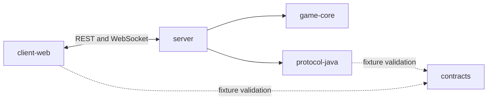

# Repository and runtime architecture

Status: proposed target structure, 7 October 2026. The repository has a minimal Java and browser scaffold and a v1 contract package with schemas and fixtures. Game/server behavior, infrastructure resources, CI workflows, and integration tests are not implemented. No original game source or assets have been audited here.

## Decision and scope

`CONTRACT.md` defines a browser client using TypeScript and Phaser with a Java/Spring Boot server. This architecture makes that browser client part of the first playable release. The client uses Vite and a small DOM lobby; React is optional after the multiplayer release. The server is authoritative. The first release uses guest sessions, one map, room codes, 2–4 players, in-memory matches, and one EC2 instance. It has no account database, leaderboard, Redis, or multi-node routing.

`CONTRACT.md` now defines the normative v1 guest-first wire behavior. `contracts/openapi.yaml`, the WebSocket and game JSON Schemas, and fixtures define the wire fields and examples. Java and TypeScript implementation classes remain independent. Accounts and leaderboard are explicitly future scope.

## Runtime view

```text
Browser: Vite + TypeScript + Phaser, small lobby UI
         | same-origin HTTPS REST + WSS
         v
EC2: Caddy (TLS, static assets, reverse proxy)
         |
         v
Spring Boot: guest session + rooms + WebSocket gateway
         | commands queued, bounded and validated
         v
Room runtime: serial state mutation per room, fixed tick
         |
         v
Plain Java game core: state + rules + events
         |
         v
Snapshots/events -> bounded per-client send queue -> browser renderer

Operational path: GitHub Actions -> ECR server + Caddy/web images -> digest-pinned deploy via SSM
                  Terraform -> VPC/EC2/EIP/IAM/ECR/CloudWatch/Budgets
                  EC2/app telemetry -> CloudWatch logs/metrics/alarms
                  external synthetic client -> public game endpoint
```

The first public deployment serves the browser build from Caddy on the same host. This keeps browser requests on one origin and simplifies guest cookies, CORS, and WSS. Use a domain pointed to an Elastic IP and let Caddy obtain and renew its certificate through HTTP-01; the security group permits TCP 80 and 443. Mount Caddy data on EBS so container releases retain the certificate. A replacement host reattaches the Elastic IP and reissues the certificate. DNS may be Terraform-managed in Route 53 or documented as an external domain configuration. S3/CloudFront becomes useful if static asset delivery needs separate hosting. The game process remains a single failure domain: a process or instance loss ends active matches. Recovery serves new matches; it does not restore matches in memory.

## Target repository layout

```text
Bomb-IT/
  README.md                    # setup, architecture summary, demo, limitations
  CONTRACT.md                  # human-readable protocol and change history
  STACK.md                     # initial stack proposal; mark historical when revised
  PROJECT_ROADMAP.md           # project-level rationale and scope
  settings.gradle.kts          # Java modules and pinned toolchain
  build.gradle.kts
  gradle/wrapper/              # reproducible Gradle version
  contracts/
    openapi.yaml               # MVP REST endpoints and error shapes
    websocket/                 # command/event JSON Schemas, envelope, version
    game/                      # wire game config and snapshot schemas
    fixtures/                  # valid/invalid JSON for compatibility checks
  game-core/
    src/main/java/.../         # pure state, rules, tick, outcome
    src/test/java/.../         # deterministic rule and replay tests
  protocol-java/
    src/main/java/.../         # Java wire DTOs and JSON mapping only
    src/test/java/.../         # schema/fixture serialization tests
  server/
    src/main/java/.../
      api/                     # guest and room REST adapters
      websocket/               # handshake, envelopes, errors, send queues
      session/                 # guest identity and reconnect window
      room/                    # room lifecycle, scheduler, command queues
      telemetry/               # metrics, structured logs, health
    src/test/java/.../         # API, WebSocket and multi-client integration tests
  client-web/
    src/protocol/              # TS wire types, validation and network adapter
    src/lobby/                 # guest, create/join, ready, status and errors
    src/game/                  # Phaser scenes, sprites, input and interpolation
    src/state/                 # snapshot/event reducer for rendering
    test/                      # fixture and reducer tests
  tests/
    bots/                      # browser-independent match bot
    load/                      # bounded load/soak scenarios and report format
    synthetic/                 # off-host end-to-end check
  infra/terraform/
    bootstrap/                 # protected state bucket, initialized separately
    demo/                      # VPC, EC2/EIP/EBS, IAM, ECR, alarms, budget, DNS if owned
  ops/
    docker/                    # server/web images and local Compose
    caddy/                     # TLS/static/proxy configuration
    deploy/                    # release by digest, drain, smoke, rollback
    runbooks/                  # restart, bad release, host loss, cost cleanup
  docs/
    ARCHITECTURE.md
    IMPLEMENTATION_PLAN.md
    adr/                       # decisions with alternatives and consequences
    evidence/                  # summarized test results and incident reports
  .github/workflows/
    ci.yml                     # client/server/contract checks on pull requests
    publish.yml                # OIDC image publish on protected main
    infra-plan.yml             # validate and review Terraform plan
    infra-apply.yml            # protected manual apply of reviewed plan
```

The current scaffold creates each area with a short README where there is no implementation yet. Add implementation files only when their plan step begins; these placeholders do not imply that the module is functional.

## Module purpose and dependency rules

| Module | Owns | Depends on | Must not own |
| --- | --- | --- | --- |
| `contracts/` | Versioned REST and WebSocket wire shapes, examples and compatibility fixtures | Nothing | Java or Phaser behavior |
| `game-core/` | Deterministic `step(state, commands, tick)` rules; collision, bombs, deaths, winner | Java standard library | Spring, sockets, UI, AWS, database |
| `protocol-java/` | Java DTOs and JSON serialization; schema fixture validation in CI | `contracts/` at test/build time | Game rules or room lifecycle |
| `server/` | Guest sessions, room state machine, WebSocket gateway, tick scheduling, health and telemetry | `game-core/`, `protocol-java/` | Rendering or persistent per-tick writes |
| `client-web/` | Input, lobby, snapshot/event reducer, Phaser rendering | `contracts/` at test/build time | Authoritative damage, movement, or winner decisions |
| `tests/` | Contract, multi-client, load and synthetic probes | Public interfaces | Production game rules |
| `infra/terraform/` | Reproducible AWS infrastructure and cost controls | AWS provider | Application release version changes |
| `ops/` | Image, local run, deployment, rollback and incident instructions | Built artifacts and provisioned infrastructure | Game behavior |



`server` maps a validated wire command into a core command and maps core events into wire events. A WebSocket callback never mutates a room directly. Each room processes commands in a defined order on its tick and produces an immutable result for broadcast. A bounded send queue and one serialized sender per connection prevent slow clients from blocking the game loop. The initial scheduler may process rooms in one process; tests must measure whether a slow room delays others.

## First-release network contract

V1 REST is `POST /api/guest-sessions`, `POST /api/games`, and `GET /api/games/{gameId}`. WebSocket `/ws` uses `JOIN_GAME`, `LEAVE_GAME`, `READY`, `PLAYER_MOVE`, `PLACE_BOMB`, and `RESYNC`. The exact commands, events, snapshots, errors, and rules are specified in `CONTRACT.md` and the schemas under `contracts/`.

The v1 envelope needs `version`, `type`, and `payload`; commands also carry `requestId`. A success acknowledgement or correlated event answers each accepted command; typed errors correlate rejected commands. The server remembers a bounded set of recent request IDs per session and returns the previous outcome for a retry instead of applying it twice. Events and snapshots carry a monotonic room sequence or tick number. On a missing sequence or reconnect, the client receives a full snapshot before applying further deltas; duplicate or out-of-order events cannot corrupt local state. Server wall-clock timestamps remain in events for diagnostics, not ordering authority. The schema must define draw results, map cells in snapshots, integer coordinate bounds, unknown-field handling, and status transitions.

The first release uses a server-issued guest session credential in an HttpOnly, Secure, SameSite cookie scoped to the game origin. REST mutations and WebSocket upgrades verify the expected `Origin`; the guest-session endpoint has its own rate limit, and the server does not trust a `playerId` supplied by the browser. The contract defines issuance, expiry, renewal, reconnect window, and session fixation behavior. Calling guest-session creation with a valid cookie returns that session without rotation; an expired cookie gets a new identity and cannot reclaim the old room slot. Limits cover frame size, command rate, rooms, players, queues, and session lifetime. A synthetic check sends `LEAVE_GAME` for both clients; the server also expires empty/finished rooms at a defined TTL.

## Delivery and operations boundaries

CI builds the Java modules and browser client, validates wire fixtures against schemas, runs deterministic core tests, and runs a two-client integration test. Publishing a release produces two ECR images from the same commit: a Spring Boot server image and a Caddy image containing the Vite browser build. A release manifest records both digests and the contract version. A deployment script drains matches, updates both digest pins in Compose, waits for readiness, then runs a public HTTP and WebSocket smoke check. On failure it restores both previous pins. This single-host operation may briefly interrupt service and cannot restore an in-memory match after a crash. Deployment records the commit, smoke result, and rollback result. Terraform changes use a separate reviewed workflow: a protected operator reviews the plan and manually applies it with a scoped role; saved plans are sensitive and never committed.

Telemetry includes a release identifier, room state counts, active connections, rejected commands, tick p95/p99 and overruns, send queue pressure, reconnect outcomes, JVM memory/GC, and server errors. Keep player and room IDs in logs, not metric labels. EC2 bootstrap installs/configures the CloudWatch Agent and grants the instance role scoped log and metric publishing permissions. CloudWatch receives bounded-retention logs and selected metrics; alarms include missing data behavior and their notification route is tested. A synthetic check outside EC2 uses two guest clients to create/join/start a disposable match, leave, and verify expiry. The dashboard and alerts should help an operator decide what action to take.

Terraform uses a separately bootstrapped S3 state bucket with encryption, versioning, restricted IAM access, and S3 lockfile support for a compatible pinned Terraform version. State and plan artifacts are treated as sensitive. The protected operator owns bootstrap state recovery and deletion; normal demo teardown retains the state bucket. A scheduled or pre-release plan checks drift. The demo stack has a documented monthly estimate and a destroy checklist for EBS, public IPv4, ECR, logs, DNS, and snapshots. [Terraform S3 backend](https://developer.hashicorp.com/terraform/language/backend/s3), [AWS CloudWatch agent](https://docs.aws.amazon.com/AmazonCloudWatch/latest/monitoring/Install-CloudWatch-Agent.html), [AWS Session Manager permissions](https://docs.aws.amazon.com/systems-manager/latest/userguide/session-manager-getting-started-instance-profile.html).
